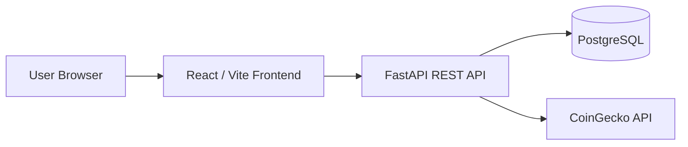

# Architecture

BTC Portfolio Dashboard follows the same clean client-server separation as the GymTracker reference project.

## Principles

- The frontend never connects directly to the database or external market APIs.
- The OpenAPI contract in `docs/openapi.yaml` is the source of truth for API shape.
- Portfolio calculations live in the backend so the frontend only renders trusted summaries.
- Market data is cached server-side to reduce external API pressure and keep UI latency stable.
- JWT access tokens protect user data; every portfolio and transaction endpoint is user-scoped.

## Backend Layout

- `app/main.py`: FastAPI app, CORS, router registration.
- `app/config.py`: environment-driven settings.
- `app/database.py`: SQLAlchemy engine and session lifecycle.
- `app/models`: SQLAlchemy persistence models.
- `app/schemas`: Pydantic request and response schemas.
- `app/routers`: HTTP route handlers.
- `app/services`: portfolio math, auth helpers, and market data integration.
- `alembic`: database migration scripts.

## Frontend Layout

- `src/api`: typed API client and endpoint functions.
- `src/auth`: auth context and protected route handling.
- `src/components/ui`: shadcn-style reusable UI primitives.
- `src/features`: feature modules for portfolio and transactions.
- `src/pages`: top-level screens.
- `src/lib`: formatters and shared utilities.

